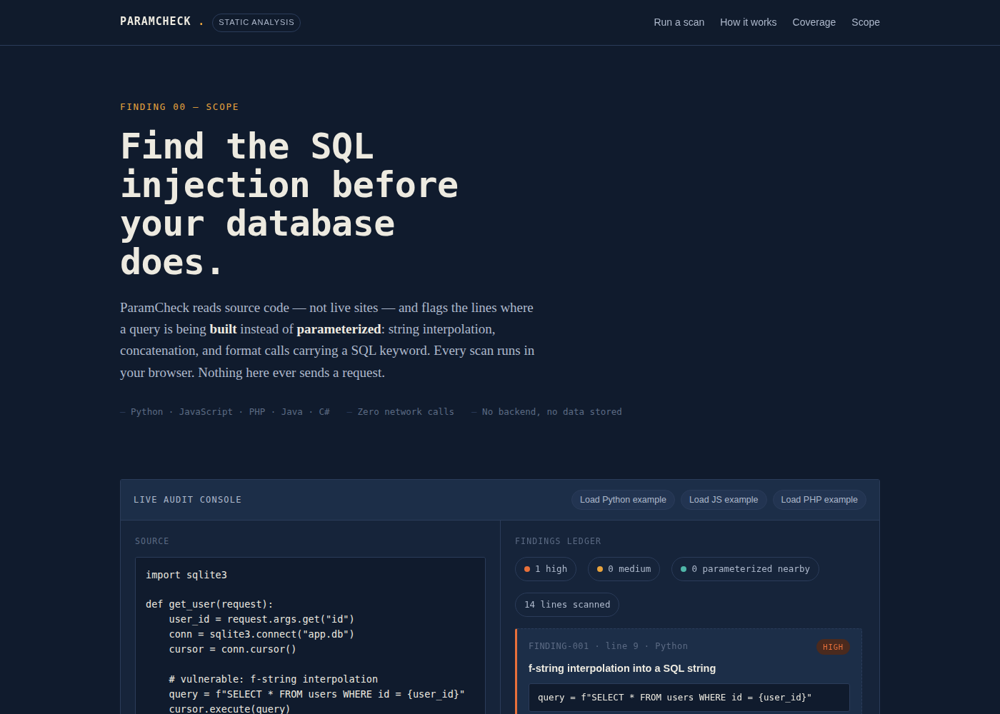

# ParamCheck

A static SQL-injection auditor that runs entirely in the browser. Paste or upload source code and it flags the lines where a query is **built** (string interpolation, concatenation, `.format()`) instead of **parameterized** — across Python, JavaScript/Node, PHP, Java, and C#.

**[Live demo →](#deploying)** (deploy in under a minute, see below)



## Why this exists

Most "SQL injection scanner" tutorials online are actually exploitation tools — they send crafted payloads at a live URL and report what broke. That's an attack script wearing a portfolio project's clothes: same capability whether the target is one you own or not.

ParamCheck takes the useful part of that idea — recognizing SQLi-prone patterns — and keeps it strictly static. It never opens a network connection. There's no target to point it at, no authorization question to sort out, no server side at all. It's a code-review aid, not a scanner.

## Features

- **Multi-language heuristics** — recognizes SQLi-prone idioms in Python (f-strings, `%`-formatting, `.format()`), JavaScript/Node (template literals), PHP (superglobal concatenation), and Java/C# (`+` concatenation into `Statement`/`SqlCommand`).
- **False-positive reduction** — checks a window of nearby lines for parameterization markers (`PreparedStatement`, `.prepare()`, `execute(query, params)`, etc.) before flagging, and downgrades matches that already look safe.
- **Severity scoring** — escalates findings to *high* when the interpolated value traces back to unsanitized request data (`req.query`, `$_GET`, `request.args`, ...).
- **Inline remediation** — every finding ships with the parameterized rewrite for that language.
- **Zero dependencies, zero backend** — plain HTML/CSS/JS. No build step, no npm install, no server.

## Known limitation

Detection is line-level pattern matching across a handful of common query-building idioms — not full AST or taint analysis. It won't trace a query string assembled across multiple lines or reconstructed through several functions, and it can both miss unconventional patterns and flag code that's actually safe. Treat findings as a fast first pass to guide manual review, not a verdict.

## Project structure

```
paramcheck/
├── index.html          # page structure and copy
├── css/
│   └── style.css        # design tokens, layout, components
├── js/
│   └── scanner.js        # the detection engine + UI wiring
├── screenshots/
│   ├── desktop.png
│   └── mobile.png
└── README.md
```

## Running locally

No build step needed — it's static HTML/CSS/JS.

```bash
# from the project folder
python3 -m http.server 8000
# then open http://localhost:8000
```

Opening `index.html` directly (`file://`) also works, with one caveat: some browsers block cross-origin font requests over `file://`, so the page falls back to system fonts until it's served over `http(s)`.

## Deploying

Since there's no backend, any static host works. A few options:

- **GitHub Pages** — push this folder to a repo, enable Pages on the `main` branch, done.
- **Netlify Drop** — drag the folder onto [app.netlify.com/drop](https://app.netlify.com/drop) for an instant URL.
- **Google Cloud Storage + Cloud CDN** — upload the folder to a public GCS bucket configured for static website hosting, front it with Cloud CDN/Load Balancer for a custom domain.
- **AWS S3 + CloudFront** — same pattern: S3 static website hosting behind a CloudFront distribution.

## Tech stack

HTML5 · CSS3 (custom properties, CSS Grid) · vanilla JavaScript (no framework, no build tooling) · IBM Plex Mono / Source Serif 4 / IBM Plex Sans (Google Fonts)

## License

MIT — see [LICENSE](LICENSE).
